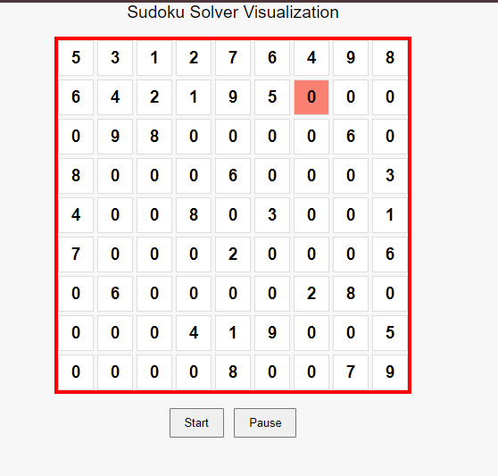

# Sudoku Solver Visualizer

This project is a Sudoku Solver visualizer that allows you to see the solving process step-by-step with real-time visualization. The project integrates a Python-based Sudoku solver with a Flask web application to display the board and control the visualization.

## Features
- Real-time visualization of the Sudoku solving process.
- Start/Pause functionality to control the visualization.
- Highlights valid entries in green and invalid entries in red.
- Displays a red border for the entire board on failure.

## Demo


*Screenshot of the Sudoku Solver Visualizer in action*


*A video demonstration of the visualizer*

## Getting Started

### Prerequisites
- Python 3.x
- Flask

### Installation

1. Clone the repository:
   ```bash
   git clone https://github.com/NyashaEysenck/sudoku-visualizer.git
   cd sudoku-visualizer

2. Install the required packages:
   pip install -r requirements.txt

3. Run the app
   python app.py

4. Open your browser and go to http://127.0.0.1:5000/ to see the visualizer in action.

### Acknowledgements
The original Sudoku solving algorithm was inspired by a tutorial by Tech with Tim. The Flask integration and visualization were implemented independently.